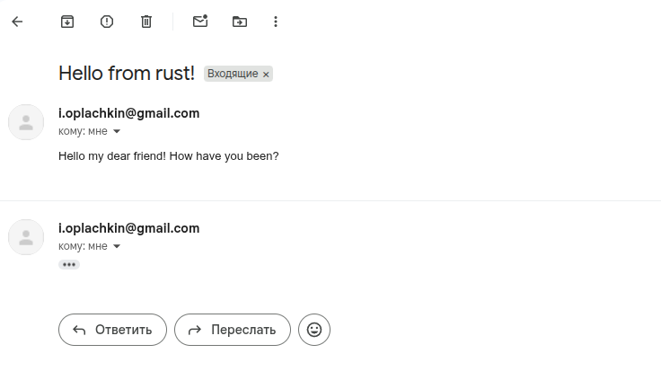
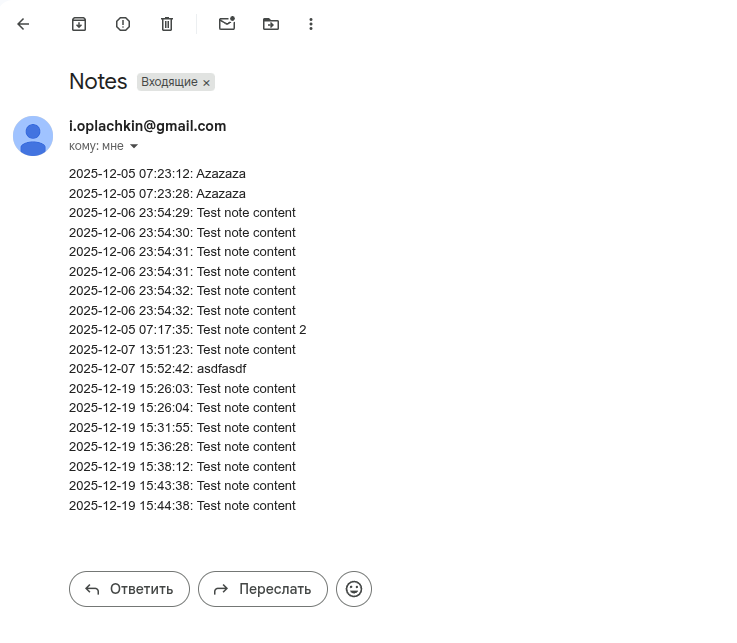

# Note Server + Load Balancer

Проект состоит из 2-х основных компонент: `note-server` и `load-balancer`, написанных полностью на Rust
Также присутствует простой gRPC клиент для проверки работы через gRPC

*О том, как запускать и настраивать проект, см. ниже*

## Note Server

Сервер с простой бизнес-логикой сохранения/изменения/удаления записок, содержащих в себе только текст

Архитектура сервера:


В качестве базы данных используется Postgres-17

Поддерживает работу по протоколам REST, SOAP и gRPC

Обрабатываемые **REST** запросы:
 - `GET /` - возрващает `"Hello world!"`, используется как health check
 - `POST /notes` - создает записку
 - `PUT /notes/{id}` - изменяет содержимое записки по id
 - `GET /notes/{id}` - получить данные записки по id
 - `GET /notes` - получить список всех записок
 - `DELETE /notes/{id}` - удалить записку по id

*Подробную REST-спецификацию можно прочитать в Swagger Doc по адресу `/swagger-ui/`*

Запросы по протоколу **SOAP** сервер принимает по `POST /soap`
Прмиеры SOAP-запросов на каждый метод находятся в папке `/notes-server/soap-examples/`

gRPC запросы сервер принимает по дефолтному gRPC порту (50051), однако во всех докер-конфигах этот порт маппится на 5000 (подробнее в части про запуск и настройку)

## Load balancer

Балансировщик запросов, поддерживающий разные виды стратегий. На данный момент реализованы: RoundRobin, Random и LeastConnections. Стратегию можно задать в конфигурации. Подробнее о всех видах настроек в `/load-balancer/config.yaml`

Корректно обрабатывает отказы серверов и их восстановление: периодически посылает health-check запросы всем своим серверам, если сервер не отвечает больше чем заданный порог по времени, то он считается умершим и не участвует в балансировке. 

Если хотим, чтобы после первого неудачного health-check сервер объявлялся умершим, можно настроить `health_check_time_limit` в `config.yaml` так, чтобы он был меньше health-check интервала

Если health-check вернул OK, то сервер считается восстановленным и возвращается в пул живых серверов

Если же сервер отказал во время обработки внешнего запроса, то этот запрос некоторое количество раз посылается другим живым в серверам в надежде, что он будет успешно обработан

Если все серверы балансировщика мертвы, то он возвращает 503 SERVICE_UNAVAILABLE, пока один из них не оживет

Умеет проксировать REST, SOAP и gRPC запросы

## gRPC Client

Простенький gRPC клиент для проверки работоспособности сервера и всех поддерживаемых видов запросов. Подробнее про его запуск в `README.md` в его директории

# Email Service + Service Mesh

## Email Service

Простенький REST-сервер, осуществляющий отправку писем с заданной в конфиге почты.
Эндпоинт для отправки - `POST /email`. Тело запроса: 
```json
{
    "to":"test@test.test",
    "subject":"Hello from rust!",
    "body":"Hello my dear friend! How have you been?"
}
```

Работа сервера проверена через Google SMTP, но свои креды к сожалению оставить в конфиге не могу, поэтому для корректной работы надо будет сделать свои по инструкции [здесь](https://timeweb.cloud/tutorials/mail/kak-ispolzovat-smtp-server-google#nastrojka-google-smtp) 



## Интеграция Email Service с Notes Service

Теперь по ручке `/share` можно отправить все записки на почту, указанную в поле `email` в теле запроса. Записки отправляются с временными отметками их создания. Для правильной работы этого метода также нужны правильные SMTP креды в конфиге почтового сервиса



## Поддержка HTTPS

В `/certs` можно найти все сгенерированные сертификаты, а именно, корневой сертификат и подписанный им сертификат сервера. Это позволяет поддерживать https на нашем сервере (через nginx или собственный балансировщик, без прокси оно работать не будет)

Для поддержки https в браузере необходимо добавить `servercert.pem` из директории `certs` в доверенные сертификаты браузера

Для доступа к серверу по https через Nginx используется порт 4443: `localhost:4443`. Адрес `localhost:4000` остается на http

В случае custom load balancer, если сервер смог найти сертификаты, то порт `localhost:4000` принимает только по https, иначе - по http, по старинке

## Side-car

Сервис side-car - прокси, который подсоединяется по внутренней сети к серверу и проксирует на него запросы. Для корректно работы пришлось немного пошаманить с заголовками в запросах и ответах: необходимо было определить, какие проксировать, а какие пересоздавать. Самое главное - он работает *только по https*, тем самым обеспечивая https-everywhere - балансировщик общается с сервисами только по https, между собой сервисы общаются также по https

Демонстрацию работы side-car сервисов в сценарии с несколькими сервисами и балансировщиком, можно запустить compose-файл `docker-compose.side-car.yml`

# Сборка и запуск

У каждой компоненты есть `Dockerfile`, его менять не нужно.

В корневой директории находится набор docker-compose файлов, которые содержат в себе разные конфигурации сервера:
Есть несколько compose-профилей:
 - `docker-compose.debug.yml` - запускает только `notes-server` + `email-service`. Также поддерживает hot-reload (для разработки)
 - `docker-compose.nginx.yml` - запускает 3 инстанса `notes-server` + 1 `email-service`, Nginx в качестве балансировщика
 - `docker-compose.custom-balancer.yml` - запускает 3 инстанса `notes-server` + 1 `email-service` с кастомным балансировщиком. Имеет 2 профиля: `http` и `https`, порты для обоих одинаковые
 - `docker-compose.multi-tier.yml` - запускает 6 инстансев `notes-server` + 1 `email-service`, по два балансировщика на 3 инстанса и сверху этих двух еще один балансировщик. Имеет 2 профиля: `http` и `https`, порты для обоих одинаковые
 - `docker-compose.side-car.yml` - запускает 3 инстанса `notes-server` + 1 `email-service`, один балансировщик и по side-car'у на каждый сервис. Тем самым получаем https-everywhere без изменения самих сервисов

Во всех конфигурациях адрес для REST/SOAP - `localhost:4000`, gRPC - `localhost:5000`

Конфигурация `load-balancer/config.yaml` используется для `release-custom-balancer`,
конфигурации из директории `load-balancer/configs` используются для `release-multi-tier`

При желании можно настроить таймауты, интервалы и стратегии каждого, порты и урлы трогать не стоит

## Запуск проекта
```docker compose -f <file-name> --profile <your-profile(if-required-by-file)> up --build```

Если понадобится завершить процесс из другой терминальной сессии:
```docker compose -f <file-name> --profile <your-profile-of-choice> down```

Команды следует запускать из корневой директории

ПРЕДУПРЕЖДЕНИЕ: конфиги с большим количеством контейнеров используют много памяти на диске
(на моем ноутбуке иногда не хватало)

Для очистки всех мертвых контейнеров можно использовать ```docker system prune``` (volumes останутся)

## Запуск gRPC клиента

Необходимо перейти в директорию `grpc-client` и выполнить команду:
```docker compose up --build```

## Эксперименты

Для симуляции отказа сервера можно убить его контейнер:
```docker kill notes-server-{id}```

Если ругается на нейминг контейнера, можно посмотреть через ```docker ps```

Для восстановления (запускать из корневой директории):
```docker compose restart server{id}```

Также имеется простой bash-скрипт `ddos.sh` для бомбардировки нашего сервера или балансировщика запросами. Интереснее всего запускать балансировщик с LeastConnections и смотреть, как он распределяет тонну запросов